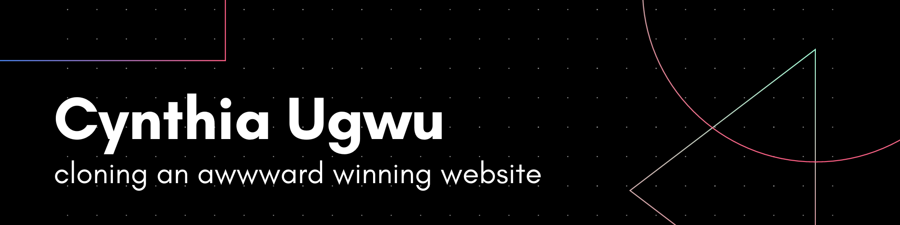

The following frameworks and languages have been used for this website:
- HTML
- JavaScript
- CSS
- SCSS
- GSAP Framework
- Locomotive Scroll Framework
- Git (for Version Control)

> ### _"My portfolio website aims to captivate and inspire visitors. With the primary objective of highlighting my skills, experience, and unique design approach." - Makujang Kamei

## What to Look Out For?

- Look out for the **entry animation** on the homepage.
- Look out for **Mouse Follower Circle** on desktop devices.
- Look out for the **Menu Section** that has a hover effect.

## Screenshots

